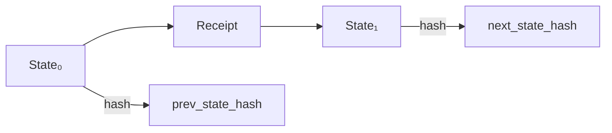
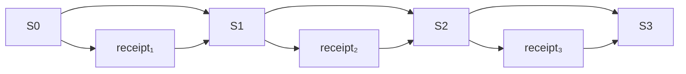
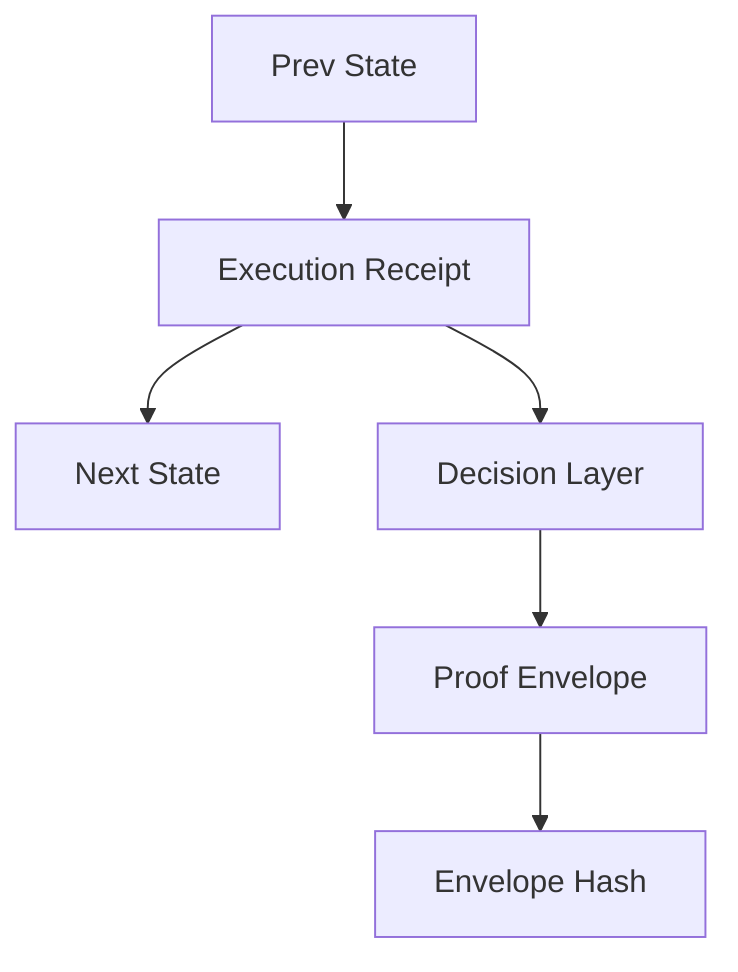
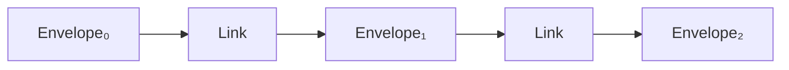
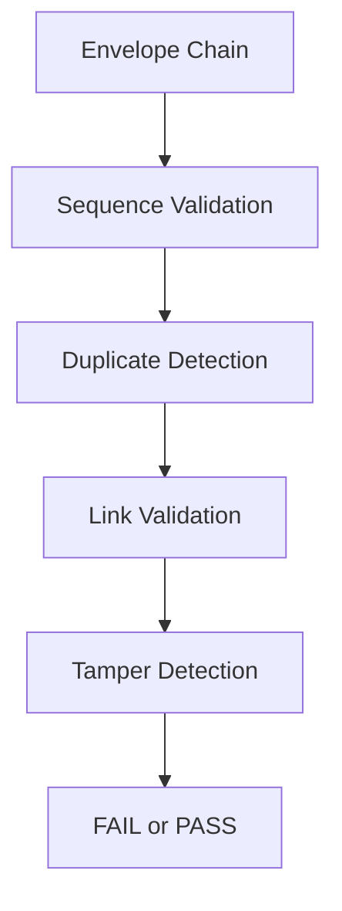
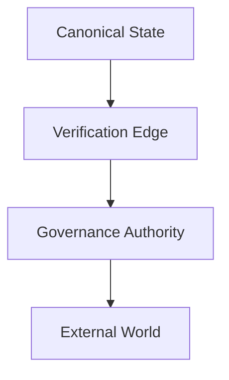

# DigiEmu Proof

Minimal prototype for deterministic execution and transition verification.

---

## Overview

DigiEmu Proof defines a minimal, verifiable standard for reconstructing and validating AI execution paths under deterministic conditions.

---

## Governance Demonstration

See the full governance demo:

`docs/demo/governance_demo_case_001_004.md`

It demonstrates:

- undeclared drift → FAIL
- declared evolution → PASS
- hidden context mutation → FAIL

---

## Core Principle

    same input → same reconstructed state → same hash

---

## System Flow

---

## Transition Model

---

## Chain Integrity

### Rules

    len(receipts) == len(states) - 1
    receipt[i].prev_state_hash == hash(states[i])
    receipt[i].next_state_hash == hash(states[i+1])

---

## Proof Envelope

### Ensures

- execution correctness  
- decision authorization  
- cryptographic binding  

---

## Composition Integrity (v0.12)

### Verifies

- envelope hash continuity  
- authority context continuity  
- policy set continuity  
- capability scope continuity  
- dependency scope continuity  
- temporal sequence correctness  

---

## Composition Hardening (v0.12.1)

### Adds

- strict sequence validation  
- no gaps allowed  
- monotonic ordering  
- duplicate envelope detection  
- required link field validation  

---

## v0.13 – Continuity Boundary Verification

Validates that a sequence of transitions forms a deterministic, unbroken chain.

### What is verified

- each transition independently valid  
- receipt ordering preserved  
- state hash continuity enforced  

    receipt[i].PrevStateHash == hash(states[i])
    receipt[i].NextStateHash == hash(states[i+1])

- chain length invariant  

    len(receipts) == len(states) - 1

### Why this matters

Detects:

- tampered intermediate states  
- reordered receipts  
- missing transitions  

---

## Reference Integrity (v0.14)

Verifies that receipt references resolve inside the declared verification context.

### Checks

- input_ref exists  
- policy_ref exists  
- output_ref exists  

### Failure semantics

    missing reference → FAIL
    unknown reference → FAIL

---

## External Dependency Boundary (v0.11)

### Contract

- what is reconstructable  
- what is externally attested  
- what is governance-authorized  
- what is outside scope  

---

## Failure Semantics

    valid execution → PASS
    invalid execution → FAIL

Failure is reproducible.

---

## Determinism Constraints

- no timestamps  
- no randomness  
- no hidden state  
- no nondeterministic outputs  

---

## Boundary Principle

    inside hash  → deterministic state
    outside hash → environment / metadata

---

## Purpose

    state → transition → state → replay → verification

---

## EU AI Act Alignment

Supports:

- traceability  
- reproducibility  
- auditability  
- governance enforcement  

---

## System Class

Deterministic Knowledge Infrastructure

---

## Case 001 – Policy Drift

Demonstrates:

valid execution ≠ coherent execution

A chain of valid transitions can fail at the composition layer
if policy context changes without declared override intent.

See: docs/cases/case_001_policy_drift.json

---

## Versions

- v0.1.0 — execution proof  
- v0.2 — boundary model  
- v0.6 — transitions  
- v0.7 — chain integrity  
- v0.8 — receipts  
- v0.9 — decision surface  
- v0.10 — proof envelope  
- v0.11 — external dependency boundary  
- v0.12 — composition integrity  
- v0.12.1 — composition hardening  
- v0.13 — continuity boundary  
- v0.14 — reference integrity  
- v0.15 — governance cases (policy + authority)

---

## Specifications

Composition Integrity Spec v0.1

---

## Authorship

Bruno Baumgartner  
DigiEmu  

---

## Acknowledgements

Gregory Whited

---

## Attribution

Please attribute:

DigiEmu / Bruno Baumgartner