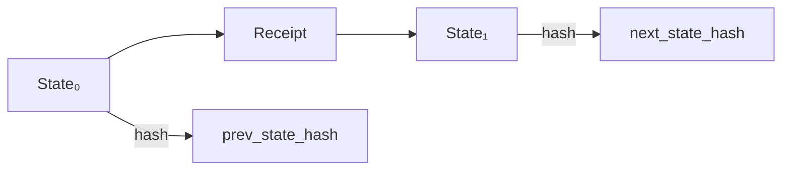
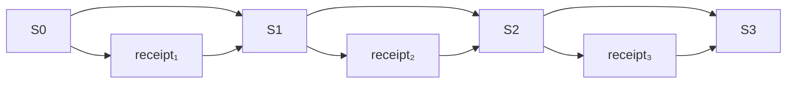
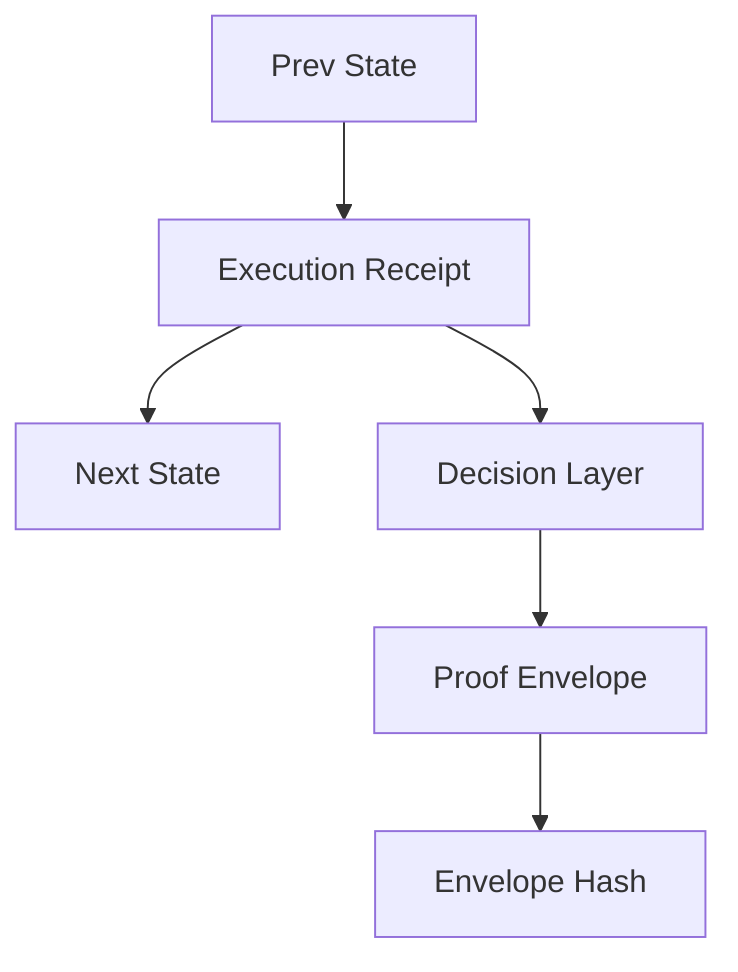
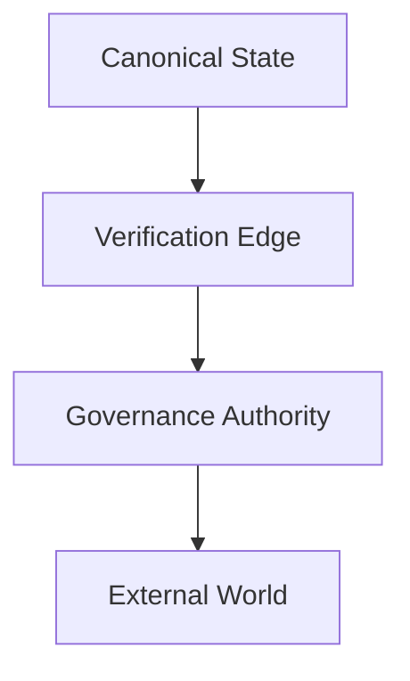
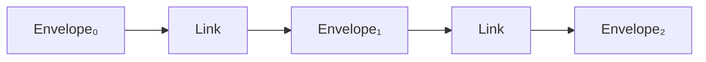
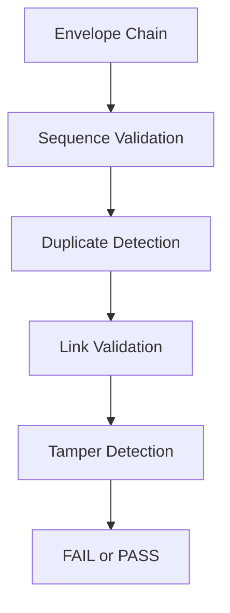

# DigiEmu Proof


Minimal prototype for deterministic execution, transition verification, governance continuity, and independently falsifiable proof artifacts.

---

## Overview

DigiEmu Proof defines a minimal, verifiable standard for reconstructing and validating AI execution paths under deterministic conditions.

It focuses on:

- deterministic state reconstruction
- canonical state hashing
- transition receipts
- chain continuity
- proof envelopes
- governance drift detection
- independently derived PASS / FAIL outcomes

---

## Core Principle

```text
same input → same reconstructed state → same hash
```

---

## Key Governance Distinctions

```text
valid execution ≠ coherent execution
```

A local transition can be valid while the larger composition or governance chain still fails.

```text
declared continuity ≠ verified continuity
```

A governance record can declare continuity while DigiEmu Proof independently returns FAIL if verification anchors drift without explicit override.

```text
boundary mapping ≠ trust merger
```

A governance system can declare what happened, while DigiEmu Proof verifies whether the declared continuity still holds.

---

## System Flow


```mermaid
flowchart LR
    A[Intent] --> B[Policy Evaluation]
    B --> C[Deterministic Action]
    C --> D[Transition Receipt]
    D --> E[Canonical State]
    E --> F[Hash SHA-256]
    F --> G[Replay]
    G --> H[Verification PASS/FAIL]
```

---

## Transition Model


```mermaid
flowchart LR
    S0[State₀] --> R[Receipt]
    R --> S1[State₁]

    S0 -->|hash| H0[prev_state_hash]
    S1 -->|hash| H1[next_state_hash]
```

---

## Chain Integrity


```mermaid
flowchart LR
    S0 --> S1 --> S2 --> S3

    R1[receipt₁]
    R2[receipt₂]
    R3[receipt₃]

    S0 --> R1 --> S1
    S1 --> R2 --> S2
    S2 --> R3 --> S3
```

### Rules

```text
len(receipts) == len(states) - 1
receipt[i].prev_state_hash == hash(states[i])
receipt[i].next_state_hash == hash(states[i+1])
```

---

## Proof Envelope


```mermaid
flowchart TB
    S0[Prev State] --> R[Execution Receipt]
    R --> S1[Next State]

    R --> D[Decision Layer]
    D --> E[Proof Envelope]
    E --> H[Envelope Hash]
```

### Ensures

- execution correctness
- decision authorization
- cryptographic binding
- verification-grade evidence

---

## External Dependency Boundary (v0.11)


```mermaid
flowchart TB
    A[Canonical State]
    B[Verification Edge]
    C[Governance Authority]
    D[External World]

    A --> B
    B --> C
    C --> D
```

### Contract

- what is reconstructable
- what is externally attested
- what is governance-authorized
- what is outside scope

---

## Composition Integrity (v0.12)


```mermaid
flowchart LR
    E0[Envelope₀] --> L1[Link]
    L1 --> E1[Envelope₁]
    E1 --> L2[Link]
    L2 --> E2[Envelope₂]
```

### Verifies

- envelope hash continuity
- authority context continuity
- policy set continuity
- capability scope continuity
- dependency scope continuity
- temporal sequence correctness

---

## Composition Hardening (v0.12.1)


```mermaid
flowchart TB
    A[Envelope Chain] --> B[Sequence Validation]
    B --> C[Duplicate Detection]
    C --> D[Link Validation]
    D --> E[Tamper Detection]
    E --> F[FAIL or PASS]
```

### Adds

- strict sequence validation
- no gaps allowed
- monotonic ordering
- duplicate envelope detection
- required link field validation

---

## Continuity Boundary Verification (v0.13)

Validates that a sequence of transitions forms a deterministic, unbroken chain.

### What is verified

- each transition independently valid
- receipt ordering preserved
- state hash continuity enforced
- chain length invariant

```text
receipt[i].PrevStateHash == hash(states[i])
receipt[i].NextStateHash == hash(states[i+1])
len(receipts) == len(states) - 1
```

### Detects

- tampered intermediate states
- reordered receipts
- missing transitions
- broken continuity

---

## Reference Integrity (v0.14)

Verifies that receipt references resolve inside the declared verification context.

### Checks

- `input_ref` exists
- `policy_ref` exists
- `output_ref` exists

### Failure semantics

```text
missing reference → FAIL
unknown reference → FAIL
```

---

## Governance Cases (v0.15–v0.16)

The governance cases demonstrate that valid local execution does not guarantee coherent governance composition.

### Cases

- [Case 001 — Policy Drift](docs/cases/case_001_policy_drift.json)
- [Case 002 — Authority Drift](docs/cases/case_002_authority_drift.json)
- [Case 003 — Declared Policy Evolution](docs/cases/case_003_declared_policy_evolution.json)
- [Case 004 — Policy Fingerprint Dependency Mutation](docs/cases/case_004_policy_fingerprint_dependency_mutation.json)

### Demo

- [Governance Demo Case 001–004](docs/demo/governance_demo_case_001_004.md)

### Demonstrates

- undeclared drift → FAIL
- declared evolution → PASS
- hidden context mutation → FAIL
- surface-level continuity can fail under dependency mutation

---

## Case 005 — Governance Record Boundary (v0.17)

Case 005 demonstrates the boundary between declared governance continuity and independently verified continuity.

```text
AIPA-like Governance Record:
What was declared?

DigiEmu Proof:
Can the declared continuity be independently verified?
```

### Demonstrates

```text
declared continuity ≠ verified continuity
```

A governance record may declare inherited continuity, while DigiEmu Proof can independently return FAIL when verification anchors drift without explicit override.

### Artifacts

- [Case 005 JSON Artifact](docs/cases/case_005_governance_record_continuity.json)
- [Governance Record Boundary Demo](docs/demo/governance_record_boundary_demo.md)

---

## AIPA Governance Record Mapping (v0.18)

The AIPA mapping work shows how an AIPA-like governance declaration can remain separate from, but compatible with, DigiEmu Proof continuity verification.

This is a mapping artifact, not product integration.

### Core Boundary

```text
AIPA says what was declared.
DigiEmu Proof says whether that declaration still holds.
```

### Mapping Artifacts

- [AIPA Governance Record Sample](docs/examples/aipa_governance_record_sample_001.json)
- [DigiEmu Case 005 Mapping Sample](docs/examples/digiemu_case_005_mapping_sample_001.json)
- [AIPA Governance Record to Case 005 Mapping](docs/mapping/aipa_governance_record_to_case_005.md)

### Boundary Semantics

- `authority_context` is an AIPA governance declaration
- `authority_anchor` is DigiEmu verification evidence
- `exported_at`, `source_system`, `approval_timestamp`, and `export_format` are audit metadata by default
- AIPA review / approval state remains a governance declaration
- DigiEmu PASS / FAIL remains independently derived

```text
boundary mapping ≠ trust merger
```

---

## Failure Semantics

```text
valid execution → PASS
invalid execution → FAIL
undeclared drift → FAIL
declared override → PASS
anchor mutation under inherit → FAIL
```

Failure is reproducible.

---

## Determinism Constraints

- no timestamps inside deterministic hash boundaries
- no randomness
- no hidden state
- no nondeterministic outputs

---

## Boundary Principle

```text
inside hash  → deterministic state
outside hash → environment / metadata / audit context
```

---

## Purpose

```text
state → transition → state → replay → verification
```

---

## EU AI Act Alignment

Supports:

- traceability
- reproducibility
- auditability
- governance enforcement
- independently verifiable execution evidence

---

## System Class

```text
Deterministic Knowledge Infrastructure
```

---

## Versions

- v0.1.0 — execution proof
- v0.2 — boundary model
- v0.6 — transitions
- v0.7 — chain integrity
- v0.8 — receipts
- v0.9 — decision surface
- v0.10 — proof envelope
- v0.11 — external dependency boundary
- v0.12 — composition integrity
- v0.12.1 — composition hardening
- v0.13 — continuity boundary
- v0.14 — reference integrity
- v0.15 — governance cases: policy + authority
- v0.16 — policy fingerprint dependency mutation
- v0.17.0 — governance record boundary implementation
- v0.17.1 — case 005 documentation and sample artifact
- v0.18.0 — AIPA governance record mapping
- v0.18.1 — boundary semantics cleanup

---

## Specifications

- [Composition Integrity Spec v0.1](docs/specs/composition-integrity-v0.1.md)
- [Policy Fingerprint Spec](docs/specs/policy_fingerprint_spec.md)

---

## Authorship

Bruno Baumgartner  
DigiEmu

---

## Acknowledgements

Gregory Whited

---

## Attribution

Please attribute:

```text
DigiEmu / Bruno Baumgartner
```